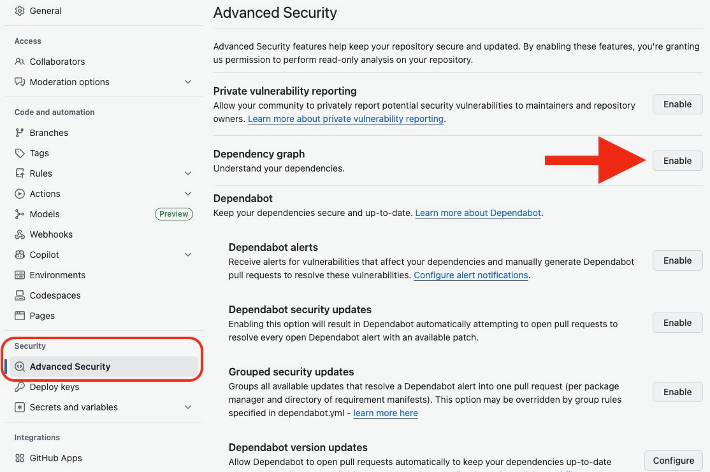

# Az-RBSI Installation Instructions

### Pre-Install
Before you even think about Az-RBSI, you need these _minimum_ versions of the
following components on your laptop and devices.

* WPILib `v2026.2.1`
* RoboRIO image `FRC_roboRIO_2026_v1.2` (comes with the FRC Game Tools from
  National Instruments)
* Driver Station `Version 26.0` (comes with the FRC Game Tools from National
  Instruments)
* CTRE Tuner X `26.2.4.0`, with all devices running firmware `26.0` or newer.
  This includes all motors, CANivore, Pigeon 2.0, and all CANcoders.
* REV Hardware Client `2.0`, with the PDH, all SPARK MAXs, and other devices
  running firmware `26.1` or newer.
* Vivid Hosting Radio firmware `2.0.1` or newer is required for competition this
  year.
* Photon Vision ([Orange Pi or other device](https://docs.photonvision.org/en/latest/docs/quick-start/quick-install.html))
  **running `26.1` or newer** (make sure you are **not** accidentally running
  `25.3`). We strongly recommend downloading the image and re-imaging the SD
  card in your co-processor instead of trying to upgrade it.

Update all of your devices and label each device with its CAN ID or IP address
and firmware version. This helps your team and FRC field staff identify issues
quickly.

If you are running a RoboRIO 1.0 (no SD card), you also need to disable the web
server ([instructions here](https://docs.wpilib.org/en/stable/docs/software/wpilib-tools/roborio-team-number-setter/index.html)).

--------

### Getting Az-RBSI
The Az-RBSI is available as a [Template Repository](
https://docs.github.com/en/repositories/creating-and-managing-repositories/creating-a-repository-from-a-template#creating-a-repository-from-a-template)
for teams to use for creating their own 2026 FRC robot code.  These instructions
assume that [you](
https://docs.github.com/en/get-started/start-your-journey/creating-an-account-on-github)
and/or [your team](
https://docs.github.com/en/get-started/learning-about-github/types-of-github-accounts#organization-accounts)
already have a GitHub account where you will store your 2026 FRC robot code.

--------

### Creating a 2026 FRC project from the Az-RBSI Template

From the [Az-RBSI GitHub page](https://github.com/AZ-First/Az-RBSI/), click the
"Use this template" button in the upper right corner of the page.

In the page that opens, select the Owner (most likely your team's account) and
Repository name (*e.g.*, "FRC-2026" or "REBUILT Robot Code" or whatever your
team's naming convention is) into which GitHub will create the new robot
project.
Optionally, include a description of the repository for your reference.  Select
"public" or "private" repository based on the usual practices of your team.

The latest release of Az-RBSI is in the `main` (default) branch, so it is
recommended to **not** select the "Include all branches" checkbox.

If you want to keep caught up on dependencies, you will need to ENABLE the
Dependency Graph selection under the "Advanced Security" tab of the repository
Settings.

* If you are struggling with this step, you may need the mentor or teacher who
  owns your GitHub organization to do it.



--------

### Software Requirements (Update Everything to 2026!)

The Az-RBSI requires the [2026 WPILib Installer](
https://github.com/wpilibsuite/allwpilib/releases) (VSCode and associated
tools), 2026 firmware installed on all hardware (motors, encoders, power
distribution, etc.), the [2026 NI FRC Game Tools](
https://www.ni.com/en/support/downloads/drivers/download.frc-game-tools.html)
(Driver Station and associated tools), and the [2026 CTRE Phoenix Tuner X](
https://v6.docs.ctr-electronics.com/en/stable/docs/tuner/index.html).  Take a
moment to update all software and firmware to the latest versions before
attempting to load your new robot project.

--------

### Setting up your new project

When your new robot code repository is created, it will have a single commit
that contains the entire Az-RBSI template for the current release.  (See the
[Az-RBSI Releases page](https://github.com/AZ-First/Az-RBSI/releases) for more
information about the latest release.)

Before you can start to use your code on your robot, there are several set up
steps you need to complete:

1. Add your team number to the `.wpilib/wpilib_preferences.json` file.  The
   generic Az-RBSI template contains a team number "0", and your code will not
   deploy properly if this variable is not set (*i.e.*, since VSCode looks for
   the RoboRIO on IP address `10.TE.AM.2`, it will not find anything if it
   tries to contact `10.0.0.2`.)  If you forget to change this value, you will
   get an error message when deploying code to your robot like:

   ```
   Missing Target!
   =============================================
   Are you connected to the robot, and is it on?
   =============================================
   GradleRIO detected this build failed due to not being able to find "roborio"!
   Scroll up in this error log for more information.
   ```

2. If you have an all-CTRE swerve base (*i.e.*, 8x TalonFX-controlled motors,
   4x CANcoders, and 1x Pigeon2), use Phoenix Tuner X to create a swerve
   project. Follow the instructions in CTRE's
   [Tuner X Swerve Project Generator](
   https://v6.docs.ctr-electronics.com/en/latest/docs/tuner/tuner-swerve/index.html).
   This generates the measured module offsets, module locations, device IDs,
   inversions, gear ratios, and base Phoenix 6 swerve constants for your drive
   train.

3. On the final screen in Tuner X, choose the option that generates only
   `TunerConstants.java`.

4. Copy that generated file into `src/main/java/frc/robot/generated/`, then
   rename it for the RBSI robot selected in `Constants.java`:

   - `COMPBOTTunerConstants.java` for `Constants.RobotType.COMPBOT`
   - `DEVBOT1TunerConstants.java` for `Constants.RobotType.DEVBOT1`
   - `DEVBOT2TunerConstants.java` for `Constants.RobotType.DEVBOT2`

   Also update the class name inside the file. For example, if you copied the
   file to `COMPBOTTunerConstants.java`, the declaration must be:

   ```java
   public class COMPBOTTunerConstants {
   ```

5. In the copied `*TunerConstants.java` file, comment out the generated import
   for `CommandSwerveDrivetrain`. RBSI does not use CTRE's generated command
   drivetrain class.

6. In the same file, comment out the generated `createDrivetrain()` function.
   RBSI constructs the drivebase through `frc.robot.subsystems.drive.Drive`,
   then reads the generated `DrivetrainConstants`, `FrontLeft`, `FrontRight`,
   `BackLeft`, and `BackRight` constants through the RBSI view classes.

7. Make sure the matching `*TunerView.java` file still points at the generated
   constants file you copied. For example, `COMPBOTTunerView` should return
   `COMPBOTTunerConstants.kCANBus`, `COMPBOTTunerConstants.DrivetrainConstants`,
   and the four public module constants. `TunerFactory` selects the right view
   from `Constants.getRobot()`, so normal drive code does not import a
   per-robot TunerConstants class directly.

8. In the copied `*TunerConstants.java`, review `kSlipCurrent`. A conservative
   starting point is `60` amps; tune it on the real robot and event carpet.

9. In the copied `*TunerConstants.java`, review `kSteerInertia` and
   `kDriveInertia`. The generic RBSI simulation expects values close to
   `0.004` and `0.025`, respectively, unless you have better measured values.

10. Open [RBSI-Constants.md](RBSI-Constants.md) and work through the sections
   that match your robot. At minimum, verify `RobotDevices`,
   `DrivebaseConstants`, `OperatorConstants`, `AutoConstants`, and
   `VisionConstants` before your first serious drive test.


**NOTE:** If you have any other combination of hardware (including REV NEOs,
NavX IMU, etc.) you will need to use the [YAGSL Swerve Configurator](
https://yet-another-software-suite.github.io/YAGSL/config_generator/) to configure the inputs for
your robot.  **Since the reference build recommends an all-CTRE swerve base**,
this functionality has not been extensively tested.  Any teams that adopt this
method are encouraged to submit bug reports and code fixes to the [Az-RBSI
repository](https://github.com/AZ-First/Az-RBSI).


--------

### Getting Started with Your Robot Code

See the Az-RBSI [Getting Started Guide](RBSI-GSG.md) for next steps. The
[documentation index](README.md) also links the drivetrain, vision, autonomous,
constants, pose-buffer, and SysId guides.

--------

### Updating your project based on the latest released version of Az-RBSI

As the season progresses, the Az-RBSI developers may add additional features
to the codebase based on user feedback and developing understanding of needed
functionality to compete well in the 2026 REBUILT game.

The Az-RBSI includes a GitHub Action that will cause your robot project
repository on GitHub to check for new updates to the template on a weekly
basis.  If a new version has been released, the `github-actions` bot will
automatically create a [Pull Request](
https://docs.github.com/en/pull-requests/collaborating-with-pull-requests/proposing-changes-to-your-work-with-pull-requests/about-pull-requests)
in your repository that includes all of the changes since either you created
the 2026 robot code or the last time you updated.  All you need to do to
accept the changes is to merge the pull request (assuming no conflicts).

If you wish to check for updates more frequently, you may force the "Sync with
Az-RBSI Template" process to run under the "Actions" tab on your repository's
GitHub page.

The update process has been re-engineered for 2026, and *should* be a straight
list of the commits that have been applied to the Az-RBSI template since the
cloning or last update.  This process *should* remove files that have been
renamed (*e.g.*, `vendordeps` files that are labeled as "beta" in the months
prior to the start of the season), but it is important to inspect the list of
file changes.  Please submit a [GitHub Issue](https://github.com/AZ-First/Az-RBSI/issues)
if you have problems with the update process.
