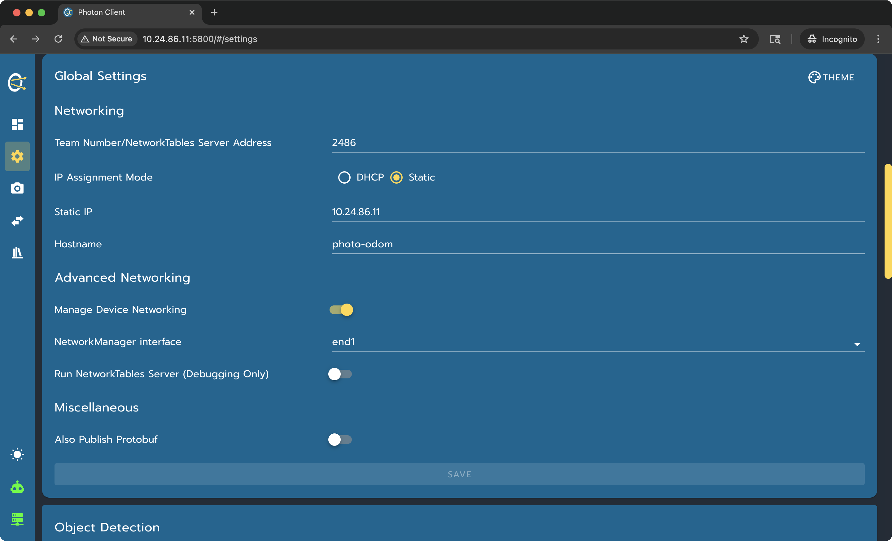
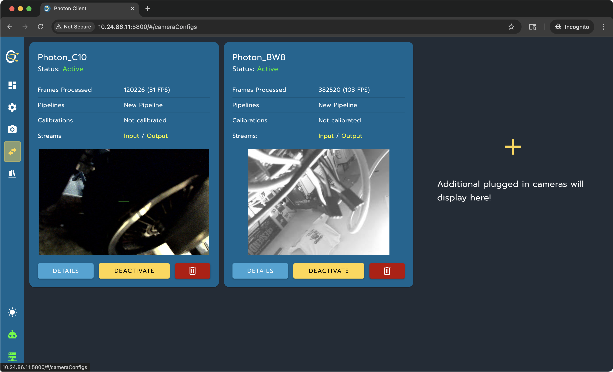

# Az-RBSI Vision Integration

This page describes how vision is wired into Az-RBSI for the 2026 REBUILT
robot template. It covers PhotonVision, Limelight, camera constants,
AdvantageKit logging, simulation, and the tuning steps that usually matter on a
real robot.

Vision in RBSI is not just a camera reader. It is part of the pose-estimation
pipeline:

1. `Imu` refreshes gyro and acceleration inputs.
2. `DriveOdometry` drains timestamped module odometry and updates the pose
   buffers.
3. `Vision` reads camera observations, filters them, time-aligns accepted
   poses, and passes measurements to `Drive.addVisionMeasurement(...)`.

That order matters. Vision observations are delayed by exposure time, pipeline
time, and network transport, so RBSI uses the drive pose buffer instead of
trying to correct the current robot pose with a stale camera pose.

## Selecting A Vision Backend

Choose the active vision backend in `Constants.java`:

```java
private static VisionType visionType = VisionType.PHOTON;
```

Supported values:

- `PHOTON`: use PhotonVision cameras described by `Constants.Cameras`.
- `LIMELIGHT`: use Limelight cameras with transforms configured in Limelight.
- `NONE`: construct no cameras, useful for bring-up or robots without vision.

Real and simulation modes build camera IO differently:

- Real PhotonVision: `VisionIOPhotonVision`
- Sim PhotonVision: `VisionIOPhotonVisionSim`
- Real Limelight: `VisionIOLimelight`
- Replay/no-camera shim: empty or no-op `VisionIO`

Use one backend at a time unless you intentionally extend the factories in
`RobotContainer`.

## Recommended PhotonVision Hardware

The preferred method for adding vision to your robot is with
[PhotonVision](https://photonvision.org/). PhotonVision combines
coprocessor-based camera control and analysis with PhotonLib for consuming
processed targeting information in robot code.

Recommended cameras:

- Arducam [OV9281](https://www.amazon.com/dp/B096M5DKY6), black and white,
  global shutter.
- Arducam [OV9782](https://www.amazon.com/dp/B0CLXZ29F9), color, global
  shutter.

Useful lens options:

- [Low-Distortion lens](https://www.amazon.com/dp/B07NW8VR71)
- [General Purpose lens](https://www.amazon.com/dp/B096V2NP2T)

Recommended coprocessor:

- One or two Orange Pi 5 single-board computers.
- Two or three cameras per coprocessor is a reasonable starting point.
- Use stable power. Do not put coprocessors on switched power ports.

PhotonVision supports other coprocessors; see the PhotonVision quick install
documentation for platform-specific images.

## PhotonVision Network Setup

Download the appropriate PhotonVision disk image for your coprocessor and burn
it to an SD card using Raspberry Pi Imager or a similar imaging tool. Connect
the powered-on coprocessor to the Vivid Hosting radio, or to a network switch
connected to the radio.

Open PhotonVision at:

```text
http://photonvision.local:5800
```

Before the coprocessor is permanently installed:

1. Set the team number.
2. Set the IP mode to static.
3. Use `10.TE.AM.11` for the first coprocessor.
4. Use `10.TE.AM.12` for the second coprocessor.
5. Give each coprocessor a clear hostname if desired.

These addresses avoid common robot-network conflicts and make camera bring-up
less mysterious during events.



## PhotonVision Camera Setup

Plug in cameras and open the Camera Configs page.



For each camera:

1. Activate the camera.
2. Set the camera name to exactly match `Constants.Cameras`.
3. Select the intended AprilTag pipeline.
4. Tune exposure and gain for the field lighting.
5. Confirm tags are detected at realistic match distances.
6. Calibrate the camera.

Camera names are string keys. If PhotonVision calls a camera `Photon_BW7`, the
matching RBSI `CameraConfig` must also be named `Photon_BW7`.

## Camera Calibration

Camera calibration is the most important part of vision bring-up.

Use the PhotonVision calibration documentation:

https://docs.photonvision.org/en/latest/docs/calibration/calibration.html

Practical rules:

- Calibrate each physical camera.
- Recalibrate after changing a lens, focus, resolution, or mount.
- Validate calibration with a tape measure.
- Recheck calibration at events when lighting or camera exposure changes.
- Keep calibration files with the coprocessor image or team deployment notes.

To sanity-check calibration, place the robot at known distances from several
AprilTags and compare PhotonVision’s reported camera-to-target distance against
real measurements.

## Camera Mounting Constants

PhotonVision camera transforms live in `Constants.Cameras`:

```java
new CameraConfig(
    "Photon_BW7",
    new Transform3d(
        Inches.of(-13.0),
        Inches.of(13.0),
        Inches.of(12.0),
        new Rotation3d(0.0, 0.0, Math.PI / 2)),
    1.0,
    new SimCameraProperties() { ... })
```

Each camera has:

- `name`: must match the PhotonVision camera name.
- `robotToCamera`: camera pose relative to robot center.
- `stdDevFactor`: per-camera trust multiplier.
- `simProps`: simulation calibration and latency model.

The transform is from robot coordinates to camera coordinates:

- X: forward positive.
- Y: left positive.
- Z: up positive.
- Rotation values are radians.

Measure camera position from the robot center, not from the bumper edge.
Document the measurement convention in your team CAD or electrical notes.

## Limelight Setup

RBSI also supports Limelight through `VisionIOLimelight`.

For Limelight:

1. Set `visionType` to `VisionType.LIMELIGHT`.
2. Configure camera name and network identity in Limelight.
3. Configure robot-to-camera transform in the Limelight web UI.
4. Confirm MegaTag outputs are available in NetworkTables.
5. Confirm the Limelight clock and latency values are reasonable.

RBSI consumes both MegaTag 1 and MegaTag 2 style observations when available.
MegaTag 2 observations receive special standard-deviation handling because
they generally do not provide useful robot rotation data in the same way as a
full 3D solve.

## VisionConstants

Vision filtering and trust are tuned in `Constants.VisionConstants`.

Important constants:

- `kTrustedTags`: tag IDs treated as more reliable.
- `kTrustedTagStdDevScale`: lower values make trusted tags more influential.
- `kUntrustedTagStdDevScale`: higher values make untrusted tags less
  influential.
- `kRequireTrustedTag`: rejects observations that contain no trusted tags.
- `kMaxAmbiguity`: rejects ambiguous single-tag solves.
- `kFieldBorderMargin`: rejects poses outside the field plus margin.
- `kZMargin` and `kMaxZErrorMeters`: reject physically unreasonable heights.
- `kLinearStdDevBaseline`: base translation uncertainty.
- `kAngularStdDevBaseline`: base rotation uncertainty.
- `kLinearStdDevMegatag2Factor`: translation scaling for MegaTag 2.
- `kAngularStdDevMegatag2Factor`: rotation scaling for MegaTag 2.

Start conservative. A pose estimate that is slightly slow to converge is much
easier to diagnose than a robot pose that jumps across the field because bad
vision was trusted too much.

## Observation Filtering

The `Vision` subsystem applies several gates before accepting an observation:

- Timestamp must be newer than the last accepted observation for that camera.
- Timestamp must not be older than the last drive pose reset.
- Observation must contain at least one tag.
- Single-tag ambiguity must be below `kMaxAmbiguity`.
- Estimated Z must be sane.
- Estimated X/Y must be inside field bounds plus margin.
- Single-tag observations are rejected while yaw rate is too high.

Accepted observations are scored and converted into `TimedPose` objects with
measurement standard deviations. RBSI chooses one best observation per camera,
then fuses accepted camera observations for the loop.

## Time Alignment And Fusion

RBSI does not simply average camera poses.

Each accepted camera observation has its own timestamp. The `Vision` subsystem:

1. Picks a fusion time, usually the newest accepted timestamp.
2. Uses the drive pose buffer to compute how the robot moved between each
   camera timestamp and the fusion timestamp.
3. Transforms older camera poses forward to the fusion time.
4. Smooths/fuses the aligned estimates.
5. Sends a `TimedPose` to `Drive.addVisionMeasurement(...)`.

This is why `DriveOdometry` must run before `Vision`. Vision needs a current,
coherent pose history before it can safely align delayed measurements.

See [RBSI-PoseBuffer.md](RBSI-PoseBuffer.md) for the deeper estimator design.

## Enabled Vs Disabled Behavior

When enabled, RBSI uses normal WPILib pose-estimator vision fusion. The
measurement standard deviations decide how strongly the estimator trusts the
vision measurement compared with odometry.

When disabled, RBSI uses a controlled blending path instead of repeated Kalman
updates. This prevents the estimator from behaving badly while the robot is
stationary and covariance is collapsing. The robot pose will gently walk toward
accepted vision rather than snapping violently.

Relevant disabled-vision constants are in `DrivebaseConstants`:

- `kDisabledVisionBlendAlpha`
- `kDisabledVisionMaxJumpM`
- `kDisabledVisionMaxJumpRad`
- `kDisabledVisionStale`
- `kDisabledVisionIgnoreAfterDisableSec`

## AdvantageKit Logging

Useful logged outputs:

- `Vision/RobotToCamera*`
- `Vision/Camera*/ObsSeen`
- `Vision/Camera*/ObsAccepted`
- `Vision/Camera*/ObsRejected`
- `Vision/Camera*/RejectReason`
- `Vision/Debug/totalObsThisLoop`
- `Vision/PoseGateResetFromDrive`
- `Vision/TagIDs`
- camera inputs under `Vision/Camera*`

If vision appears broken, open AdvantageScope and inspect:

1. Are camera inputs updating?
2. Are tags being seen?
3. Are observations rejected?
4. What reject reason dominates?
5. Are timestamps plausible?
6. Does the camera transform look correct?

## Simulation

PhotonVision simulation uses:

- `VisionSystemSim`
- `PhotonCameraSim`
- `VisionIOPhotonVisionSim`
- `SimCameraProperties` from `Constants.Cameras`

Simulation is useful for verifying:

- camera names,
- camera transforms,
- approximate field of view,
- pose fusion plumbing,
- AdvantageKit logging paths.

It is not a substitute for real calibration. Simulated cameras do not capture
all real-world effects: glare, motion blur, focus, exposure, network jitter,
dirty lenses, and event lighting.

## Bring-Up Checklist

1. Select `visionType`.
2. Configure camera names and transforms.
3. Install and image coprocessors.
4. Set static coprocessor IP addresses.
5. Calibrate every camera.
6. Confirm PhotonVision or Limelight sees tags.
7. Deploy robot code.
8. Confirm AdvantageKit camera inputs update.
9. Check observation reject reasons.
10. Tune trust and standard-deviation constants.
11. Test disabled pose convergence.
12. Test enabled driving while vision is active.
13. Test autonomous path tracking with vision enabled.

## Troubleshooting

Camera never connects:

- Check camera name.
- Check coprocessor IP address.
- Check robot radio/switch wiring.
- Check USB cable and camera enumeration.

Tags are seen but all poses are rejected:

- Check `RejectReason`.
- Check tag ambiguity.
- Check field layout selection.
- Check camera calibration.
- Check robot-to-camera transform.

Pose jumps sideways or rotates incorrectly:

- Re-measure `robotToCamera`.
- Check radians vs degrees.
- Check camera coordinate orientation.
- Check IMU orientation constants.

Vision works disabled but gets rejected while driving:

- Check yaw-rate gating.
- Check timestamp latency.
- Check pose buffer history length.
- Check camera exposure and blur.

Autonomous gets worse with vision enabled:

- Reduce trust by increasing standard deviations.
- Require trusted tags.
- Verify field layout.
- Verify all camera transforms.
- Confirm odometry is already stable without vision.

## Related Pages

- [RBSI-Drive.md](RBSI-Drive.md): odometry bring-up before vision fusion.
- [RBSI-PoseBuffer.md](RBSI-PoseBuffer.md): latency compensation and
  time-aligned measurement design.
- [RBSI-Autonomous.md](RBSI-Autonomous.md): autonomous pose reset and match-flow
  rules.
